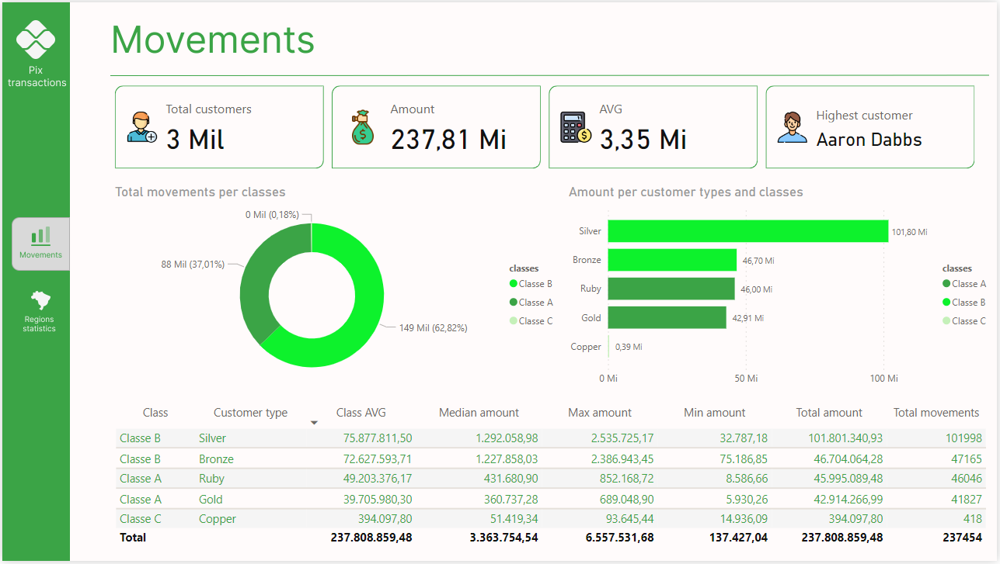

# Customers pix movements Power BI dashboard

### This is a Power BI dashboard created with the aim of using the views created in the [dbt_analytics](https://github.com/TiagoBHeck/dbt_analytics) project.

## Objective

#### This dashboard aims to highlight some of the most important features present in Power BI and also present how a data analysis project can be built starting from data extraction, creation of personalized views (using DBT) and import of the data model (view) into BI.

## About data transformation

#### The image below shows the data transformation flow
&nbsp;

## Dashboard tabs

### Movements

#### The first tab highlights customer classifications according to the defined transaction categories. It is worth noting that these categories are merely illustrative and serve only to show Power BI's visualization features.
&nbsp;

### Regions statistics

#### The second tab shows the total movements according to their geographical location. This tab has a dynamic state selection feature

## Next steps

### This is the first dashboard created and published in this data repository. The intention is to develop other more advanced work involving other data collection and transformation tools and subsequent construction of more elaborate dashboards.

## Author
- Tiago Bratz Heck
##### Access my [LinkedIn](https://www.linkedin.com/in/tiago-bratz-heck-0b9b5696/) profile.

